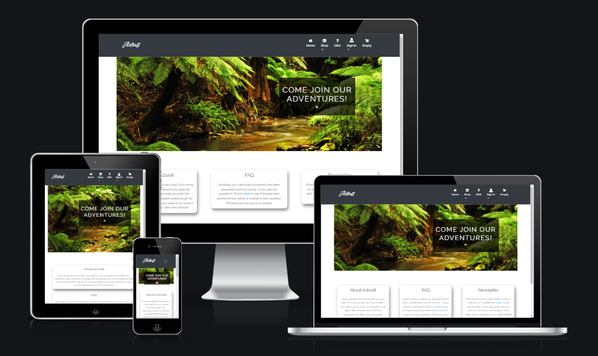

# Active8

## Purpose
Active8 is an eCommerce shop for people looking for an at-home adventure. Any user can view products, shop and sign up for a newsletter, but only registered users can add questions and have their orders saves to their profiles.

A full list of technologies used can be found in the technologies section of this document. Note that GitHub as of March 2021 automatically creates a Table of Contents for the README file.

## Active8 Responsive Website




[Link to deployed site](https://active8-advenstures.herokuapp.com/)

## UX

This website was created to showcase my knowledge in Fullstack Development eCommerce and to provide users with a place to browse for and buy adventures.

### User Stories:

Github issues were used to record the user stories. Stories were categorized into different priorities: “Must have”, “Should Have” and “Could Have”.


#### Site administrator:

-

#### Users:

-


#### Could haves (not implemented yet)
-

### Wireframes

Wireframes were created with Balsamiq and are uploaded to a separate folder - [View](/assets/wireframes/).
Some modifications were made during the development process for improved usability and user experience.

### Design

#### Imagery

Images are from Shutterstock. It does make use of Font Awesome icons for visual enhancement.

#### Typography

The font used for my website is "Water Brush" for the logo part and Raleway for main site. The font is provided by Google Fonts.

#### Colour scheme

I chose a light theme with dark header and footer. A bright turquoise is used for details/buttons for contrast.

#### Model

An initial model was created with and is uploaded to a separate folder along with ERDs. ERDs have been modified along the way and final versions can be viewed here - [View](assets/erd_initial/Database%20ER%20diagram%20_24May2022_final.pdf)


#### Agile Methodology

Github Issues were used to create User Stories and group them according to MoSCoW prioritization technique. [GitHub Projects](https://github.com/CeciliaSwe/portfolio-5th/projects/1) and Kanban board was used to visualize and execute the agile methodology. The issues are currently in two categories: “Done” and “For next release”.

## Features

### Existing Features

#### Navbar and footer

- Navbar and footer are using Bootstrap components and are adjusted to the needs of the project.


##### Home page

- Home page consists of a Welcome Hero image with a short message to view advenstures along with 3 info boxes.


#### Products

- Clicking "Come join our adventures" will take the user to the products page and display all products. Navigating to products from the navbar (Shop dropdown) provides the user with the option to display all advenstures, or to filter based on indended end user age.


#### Product details

#### FAQ

#### Cart

#### Payment

#### Newsletter

#### CRUD functionality

#### Signup / Login / Logout

- Users can signup to gain access to all features


#### Toasts


### Features Left to Implement

- Allow users to search for products
- Allow users to add favorite products for later
- Allow user to login via social media
- Allow users to sort products by difficulty, by price etc.
- Allow users to leave reviews on products they have purchased

##### Return to [top](#active8)

### SEO

### Facebook

Active8 utilises a mock Facebook page for marketing purposes to post adverts, interesting content and get users engaged. Full Facebook wireframes can be found [here](assets/facebook_marketing.pdf)


## Technologies Used

### Languages

* HTML5
	* This project uses HTML5 as the main language for content and structure of the Website.
* CSS3
	* This project uses CSS3 for Website styling
* Javascript
	*  This project uses Javascript for the required logic to allow for interactivity
* Python
	* Back-end language that the Django framework is based on

### Frameworks, Libraries and Programs used

* [Django](https://www.djangoproject.com/)
	* High-level Python web framework used to build this application
* [Bootstrap](https://getbootstrap.com/)
	* For components and styling
* [Font Awesome](https://fontawesome.com/)
	* Font awesome Icons are used
* [Google Fonts](https://fonts.google.com/)
	* Google fonts are used throughout the project to import the relevant fonts
* [GitHub](https://github.com/)
	* GithHub is the hosting site used to store the source code for the Website and [Git Pages](https://pages.github.com/) is used for the deployment of the live site.
* [GitPod](https://gitpod.io/)
	* GitPod is used as version control software to commit and push code to the GitHub repository where the source code is stored.
* [Google Chrome Developer Tools](https://developers.google.com/web/tools/chrome-devtools)
	* Google chromes built in developer tools are used to inspect page elements and help debug issues with the site layout and test different CSS styles.
* [Balsamiq Wireframes](https://balsamiq.com/wireframes/)
	* Balsamiq was used to create wireframes and UX design during the planning and design process.
* [Am I Responsive?](http://ami.responsivedesign.is/)
	* Used to generate the screenshots for responsive design.
* [Heroku](https://dashboard.heroku.com/)
	* Could application platform where the deployed application is served from
* [AWS S3](https://aws.amazon.com/)
	* For static and media files
* Heroku Postgres
    * PostgreSQL is one of the world's most popular relational database management systems.
* [Tiny JPG](https://tinyjpg.com/)
    * To compress images for the web
* [Shutterstock](https://www.shutterstock.com/)
    * For images used on the page


##### Return to [top](#active8)

## Testing

Owing to time constraints, it was not possible to design and implement automatic Unit-testing for this project, and so extensive manual testing was completed instead.
An MS Excel workbook detailing these tests and outcomes can be found [here]()

### Role Based Access Control

Role based access control was implemented and full Role Base Access Control (RBAC) matrix is found in the Excel testing workbook [here]()


### Bugs

#### Resolved Bugs

- Add to cart functionality not functioning. Resolved by
- Form input fields visible to all when intended for superusers only. Resolved by restarting the GitPod environment
- Delete from cart functionality not functioning. Resolved by
- Update cart functionality not working, resolved by rearranging the DOM to align with the javascript executing the function
- Footer not staying at bottom of screen, resolved by setting a negative top margin to the footer
- Navbar disabled with toasts, resolved by removing fixed toast sizing


#### Unresolved bugs

- Specific to iOS; updating the item quantity in prpduct cart and tapping "Update" does not update the quantity. Updating the quantity ad tapping "OK" from the pop-up keyboard does update the quantity. Functionality works as expected when testing on Mobile S/M/L on pc.


### Validation

#### HTML valiation

HTML pages have been validated through the [HTML validator](https://validator.w3.org/nu/#textarea) without errors.
Copies of the report can be found [here](assets/validation/HTML/)


#### CSS validation

No errors were found when passing through the official [W3C validator](https://jigsaw.w3.org/css-validator/). CSS validation results can be found [here](http://jigsaw.w3.org/css-validator/validator?lang=en&profile=css3svg&uri=https%3A%2F%2Factive8-adventures.herokuapp.com%2F&usermedium=all&vextwarning=&warning=1)

#### JavaScript validation

Javascript code validation was complited on [jshint](https://jshint.com/)
Errors relating to ES6 syntax was resolved by adding this line to the beginning of the file:
```
/*jshint esversion: 6*/
```

No errors were found with the exception of stripe_element.js which returns "undefined variables". This is due to core functionality referring to Stripe. Copy of the code was taken from older version Stripe pages that were referenced in Butique Ado.


A copy of the report can be found [here](/assets/validation/Javascript/jshint_validation.pdf)


#### Python validaton

The Python pages have been validated though the PEP8 validator. Copies of the reports can be found [here](assets/validation/Python/)


##### Return to [top](#active8)

## Deployment

### Initial Deployment to Heroku

**In your app / GitPod**

1. Create new repository from CI template
2. Install Django and required dependencies into Gitpod workspace
3. Create new Django project and app
4. Create Procfile as required
5. Run "pip3 freeze --local > requirements.txt" to update requirements file
6. Git add and git commit the changes made


**Log into heroku**

3. Log into [Heroku](https://dashboard.heroku.com/apps) or create a new account and log in
4. top right-hand corner click "New" and choose the option Create new app, if you are a new user, the "Create new app" button will appear in the middle of the screen
5. Write app name - it has to be unique, it cannot be the same as this app
6. Choose Region - I am in Europe
7. Click "Create App"


**Add Postgres and set Config Vars**

8. Go to Resources Tab, Add-ons, search and add Heroku Postgres
9. Choose "settings" from the menu on the top of the page
10. Go to section "Config Vars" and click button "Reveal Config Vars".
11. Add the below variables to the list
    * Database URL will be added automaticaly
    * Secret_key - is the Django key
    * AWS S3 - ADD
    * Configure "DISABLE_COLLECTSTATIC = 1" in Config Vars


**GitPod/GitHub**

12. Procfile needs to be created in your app
```
web: gunicorn PROJ_NAME.wsgi
```

13. In settings in your app add Heroku to ALLOWED_HOSTS
14. Add and commit the changes in your code and push to github


**Final step - deployment**


15. Open the terminal.
16. Assuming MFA/2FA is used, click on Account Settings (under the avatar menu) on the Heroku Dashboard.
17. Scroll down to the API Key section and click Reveal. Copy the API key.
18. Gitpod workspace, enter the following command in the terminal: heroku_config and enter your API key that you copied when prompted.
19. To get your app name from Heroku, enter the following command in the terminal: heroku apps
20. To set the Heroku remote: Enter the following command in the terminal: heroku git:remote -a <app_name>
21. Add and commit any changes to your code, if applicable.
22.   Push to both GitHub and Heroku
For GitHub: Enter the following command in the terminal: git push origin main
For Heroku: Enter the following command in the terminal: git push heroku main

23. Click the button "View"


### Final Deployment

Gitpod
    1. Ensure all required files up-to-date and that application is working
    2. Run "pip3 freeze --local > requirements.txt" to update requirements file
    3. Ensure "DEBUG = False" set in settings.py
    4. Perform commit and push to GitHub

Heroku
    1. Under the app, browse to Config Vars
    2. Remove the value "DISABLE_COLLECTSTATIC = 1" from Config Vars

 GitPod
    1. Enter the following command in the terminal: git push heroku main
    2. Enter credentials as needed


### Forking the GitHub Repository

By forking the GitHub Repository you will be able to make a copy of the original repository on your own GitHub account allowing you to view and/or make changes without affecting the original repository by using the following steps:

1. Log in to GitHub and locate the [GitHub Repository](https://github.com/CeciliaSwe/portfolio-5th)
2. At the top of the Repository, click the "Fork" button.
3. You should now have a copy of the original repository in your GitHub account.

### Making a Local Clone

1. Log in to GitHub and locate the [GitHub Repository](https://github.com/CeciliaSwe/portfolio-5th)
2. Under the repository name, click "Clone or download".
3. To clone the repository using HTTPS, under "Clone with HTTPS", copy the link.
4. Open commandline interface on your computer
5. Change the current working directory to the location where you want the cloned directory to be made.
6. Type `git clone`, and then paste the URL you copied in Step 3.

```
$ git clone https://github.com/CeciliaSwe/portfolio-5th
```

7. Press Enter. Your local clone will be created.

### Setting up your local enviroment

1. Create Virtual enviroment on your computer or use gitpod built in virtual enviroment feature.
2. Create env.py file. It needs to contain those 5 variables.

* Database URL can be obtained from [heroku](https://dashboard.heroku.com/), add PostgreSQL as an add on when creating an app.
* Secret_key - is the Django secret key
* AWS S3


```
os.environ["DATABASE_URL"] = "..."
os.environ["SECRET_KEY"] = "..."
os.environ["CLOUDINARY_URL"] = "..."
os.environ["DEVELOPMENT"] = "True"
```

3. Run command
```
pip3 install -r requirements.txt
```


##### Return to [top](#active8)

## Credits

This project is based on the "Boutique Ado" walkthrough from Code Institute, however all code has been customized and adapted for this project, both backend and frontend. Other inspiration and tutoritals are credited as per below:

- Newsletter app
-


### Acknowledgements
-   To my Mentor [Chris Quinn](https://github.com/10xOXR) for guidance and pushing me to make smart choices.
-   To CI Tutors for debugging and pointing in the right direction.

##### Return to [top](#active8)